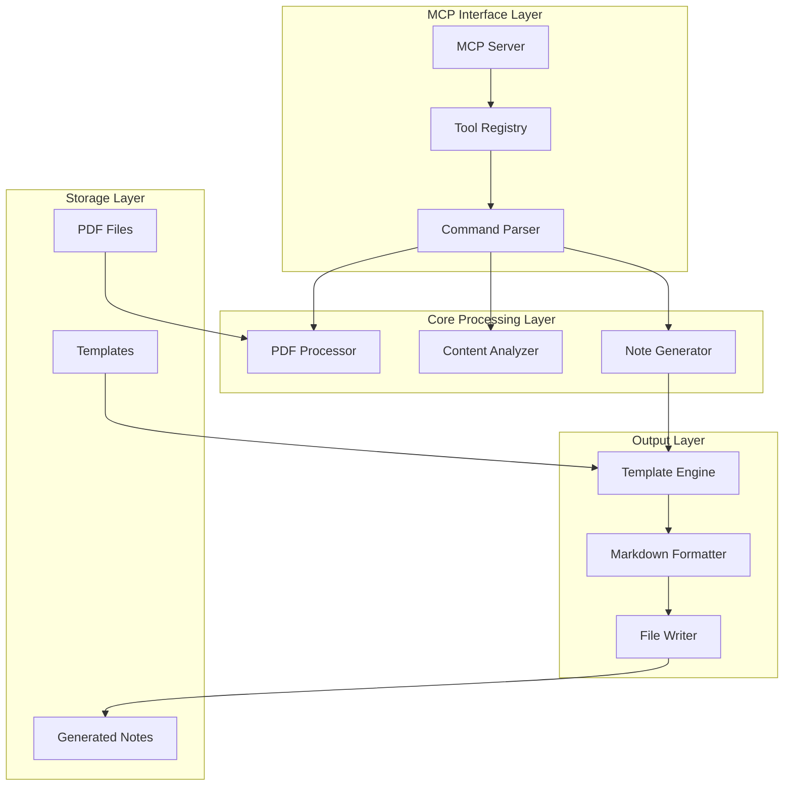

# Design Document

## Overview

The scholarsquill MCP server is a standalone Model Context Protocol server that transforms scientific PDF papers into structured markdown literature notes. The server implements a clean, modular architecture with built-in PDF processing, intelligent content analysis, and flexible output formatting. It provides a simple command interface (`/sq:note`) with various options for focus, depth, and batch processing.

## Architecture

### High-Level Architecture



### Component Architecture

The server follows a layered architecture with clear separation of concerns:

1. **MCP Interface Layer**: Handles MCP protocol communication and tool registration
2. **Core Processing Layer**: Manages PDF processing, content analysis, and note generation
3. **Output Layer**: Handles template processing and markdown formatting
4. **Storage Layer**: Manages file I/O operations

## Components and Interfaces

### 1. MCP Server Component

**Purpose**: Main entry point implementing MCP protocol
**Key Classes**:
- `ScholarsQuillServer`: Main server class
- `ToolRegistry`: Manages available tools and their schemas

**Interface**:
```python
class ScholarsQuillServer:
    async def initialize(self) -> None
    async def handle_tool_call(self, tool_name: str, arguments: dict) -> dict
    async def list_tools(self) -> List[Tool]
```

### 2. PDF Processor Component

**Purpose**: Extracts text and metadata from PDF files
**Key Classes**:
- `PDFProcessor`: Main PDF processing class
- `MetadataExtractor`: Extracts paper metadata

**Interface**:
```python
class PDFProcessor:
    def extract_text(self, pdf_path: str) -> str
    def extract_metadata(self, pdf_path: str) -> PaperMetadata
    def get_page_count(self, pdf_path: str) -> int
    def validate_pdf(self, pdf_path: str) -> bool
    def generate_citekey(self, metadata: PaperMetadata) -> str

class PaperMetadata:
    title: str
    first_author: str
    authors: List[str]
    year: Optional[int]
    citekey: str
    item_type: str
    journal: str
    volume: Optional[str]
    issue: Optional[str]
    pages: Optional[str]
    doi: Optional[str]
    abstract: Optional[str]
    page_count: int
```

### 3. Content Analyzer Component

**Purpose**: Analyzes paper content and classifies paper type
**Key Classes**:
- `ContentAnalyzer`: Main analysis engine
- `PaperClassifier`: Determines paper type
- `SectionExtractor`: Identifies paper sections

**Interface**:
```python
class ContentAnalyzer:
    def analyze_content(self, text: str, focus: str) -> AnalysisResult
    def classify_paper_type(self, text: str) -> Tuple[str, float]
    def extract_sections(self, text: str) -> Dict[str, str]
    def extract_key_concepts(self, text: str, focus: str) -> List[str]

class AnalysisResult:
    paper_type: str
    confidence: float
    sections: Dict[str, str]
    key_concepts: List[str]
    equations: List[str]
    methodologies: List[str]
```

### 4. Note Generator Component

**Purpose**: Generates structured markdown notes from analyzed content
**Key Classes**:
- `NoteGenerator`: Main note generation engine
- `TemplateProcessor`: Processes note templates
- `ContentStructurer`: Structures content according to templates

**Interface**:
```python
class NoteGenerator:
    def generate_note(self, content: str, metadata: PaperMetadata, 
                     focus: str, depth: str) -> str
    def apply_template(self, template_name: str, content: dict) -> str
    def format_citations(self, metadata: PaperMetadata) -> str

class TemplateProcessor:
    def load_template(self, template_name: str) -> Template
    def render_template(self, template: Template, data: dict) -> str
```

### 5. Command Interface

**Purpose**: Parses and handles `/sq:note` commands
**Key Classes**:
- `CommandParser`: Parses command arguments
- `BatchProcessor`: Handles batch operations

**Interface**:
```python
class CommandParser:
    def parse_command(self, command: str) -> CommandArgs
    def validate_arguments(self, args: CommandArgs) -> bool

class CommandArgs:
    target: str
    focus: str = "balanced"
    depth: str = "standard"
    format: str = "markdown"
    batch: bool = False
    output_dir: Optional[str] = None
```

## Data Models

### Core Data Structures

```python
@dataclass
class PaperMetadata:
    title: str
    first_author: str
    authors: List[str]
    year: Optional[int] = None
    citekey: str = ""
    item_type: str = "journalArticle"
    journal: str = ""
    volume: Optional[str] = None
    issue: Optional[str] = None
    pages: Optional[str] = None
    doi: Optional[str] = None
    abstract: Optional[str] = None
    page_count: int = 0
    file_path: str = ""

@dataclass
class ProcessingOptions:
    focus: str = "balanced"  # research, theory, review, method, balanced
    depth: str = "standard"  # quick, standard, deep
    format: str = "markdown"
    batch: bool = False
    output_dir: Optional[str] = None

@dataclass
class NoteContent:
    title: str
    citation: str
    sections: Dict[str, str]
    metadata: PaperMetadata
    generated_at: datetime
    processing_options: ProcessingOptions
```

### Template Structure

```python
@dataclass
class NoteTemplate:
    name: str
    description: str
    sections: List[TemplateSection]
    focus_areas: List[str]

@dataclass
class TemplateSection:
    title: str
    description: str
    required: bool = True
    content_type: str = "text"  # text, list, equation, citation
```

## Error Handling

### Error Categories

1. **File Errors**: PDF not found, unreadable, corrupted
2. **Processing Errors**: Text extraction failure, analysis errors
3. **Template Errors**: Template not found, rendering errors
4. **MCP Errors**: Protocol errors, tool call failures

### Error Response Format

```python
@dataclass
class ErrorResponse:
    success: bool = False
    error_type: str
    error_message: str
    error_code: str
    suggestions: List[str] = field(default_factory=list)
    
    def to_dict(self) -> dict:
        return {
            "success": self.success,
            "error": {
                "type": self.error_type,
                "message": self.error_message,
                "code": self.error_code,
                "suggestions": self.suggestions
            }
        }
```

### Error Handling Strategy

- **Graceful Degradation**: Continue processing when possible
- **Clear Error Messages**: Provide actionable error information
- **Fallback Options**: Offer alternative processing methods
- **Logging**: Comprehensive error logging for debugging

## Testing Strategy

### Unit Testing

- **PDF Processing**: Test text extraction, metadata extraction
- **Content Analysis**: Test paper classification, section extraction
- **Note Generation**: Test template rendering, content structuring
- **Command Parsing**: Test argument parsing, validation

### Integration Testing

- **End-to-End Workflows**: Test complete note generation process
- **MCP Protocol**: Test tool registration and execution
- **Batch Processing**: Test multiple file processing
- **Error Scenarios**: Test error handling and recovery

### Test Data

- **Sample PDFs**: Collection of different paper types
- **Expected Outputs**: Reference notes for comparison
- **Edge Cases**: Corrupted PDFs, unusual formats
- **Performance Tests**: Large files, batch processing

### Testing Framework

```python
class TestSuite:
    def test_pdf_processing(self):
        # Test PDF text extraction and metadata
        pass
    
    def test_content_analysis(self):
        # Test paper classification and analysis
        pass
    
    def test_note_generation(self):
        # Test template rendering and formatting
        pass
    
    def test_mcp_integration(self):
        # Test MCP protocol compliance
        pass
    
    def test_batch_processing(self):
        # Test multiple file processing
        pass
```

## Implementation Details

### Directory Structure

```
scholarsquill/
├── src/
│   ├── __init__.py
│   ├── server.py              # Main MCP server
│   ├── pdf_processor.py       # PDF processing
│   ├── content_analyzer.py    # Content analysis
│   ├── note_generator.py      # Note generation
│   ├── template_engine.py     # Template processing
│   ├── command_parser.py      # Command parsing
│   └── utils.py              # Utility functions
├── templates/
│   ├── research.md           # Research paper template
│   ├── theory.md             # Theoretical paper template
│   ├── review.md             # Literature review template
│   └── method.md             # Methodology template
├── tests/
│   ├── test_pdf_processor.py
│   ├── test_content_analyzer.py
│   ├── test_note_generator.py
│   └── test_integration.py
├── examples/
│   ├── sample_papers/        # Sample PDF files
│   └── expected_outputs/     # Expected note outputs
├── requirements.txt
├── pyproject.toml
└── README.md
```

### Metadata Format

The server will extract and format metadata following the academic citation standard:

```
> [!Metadata]
> **FirstAuthor**:: LastName, FirstName
> **Author**:: , LastName, FirstName  
> **Author**:: , LastName, FirstName
> **Title**:: Paper Title
> **Year**:: YYYY
> **Citekey**:: authorYEARkeyword
> **itemType**:: journalArticle
> **Journal**:: *Journal Name*
> **Volume**:: XX
> **Issue**:: X
> **Pages**:: XXXXXX
> **DOI**:: XX.XXXX/XXXXXXX
```

### Key Dependencies

- **MCP Framework**: `mcp` for protocol implementation
- **PDF Processing**: `PyPDF2` or `pdfplumber` for text extraction
- **Text Analysis**: `nltk` or `spacy` for content analysis
- **Template Engine**: `jinja2` for template processing
- **File Handling**: `pathlib` for path operations
- **Async Support**: `asyncio` for async operations

### Configuration

```python
@dataclass
class ServerConfig:
    default_output_dir: str = "literature-notes"
    default_templates_dir: str = "templates"
    max_file_size_mb: int = 50
    batch_size_limit: int = 100
    enable_caching: bool = True
    log_level: str = "INFO"
```

### Performance Considerations

- **Caching**: Cache processed content to avoid reprocessing
- **Streaming**: Stream large PDF processing for memory efficiency
- **Parallel Processing**: Process multiple files concurrently in batch mode
- **Resource Limits**: Implement file size and batch size limits

This design provides a solid foundation for implementing the scholarsquill MCP server with clear separation of concerns, robust error handling, and comprehensive testing strategy.