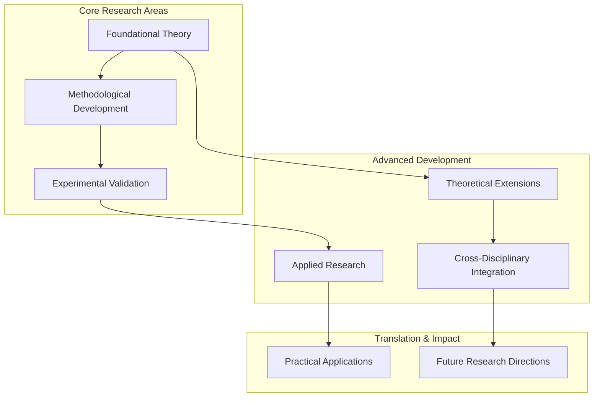

# {{ topic }}: A Critical Literature Synthesis

## Executive Summary

This critical literature synthesis examines **{{ topic }}** through analysis of {{ papers_analyzed }} relevant publications, identifying key research themes, methodological approaches, convergent findings, and critical knowledge gaps. The analysis provides comprehensive understanding of the current state of knowledge and evidence-based recommendations for future research priorities.


**Key Findings**: {{ key_findings_summary }}

**Key Findings**: Systematic analysis reveals significant insights into {{ topic }}, with convergent evidence supporting core theoretical frameworks and methodological innovations driving field advancement.



**Critical Gaps**: {{ critical_gaps.understudied_areas|length }} understudied areas and {{ critical_gaps.methodological_gaps|length }} methodological limitations identified.

**Critical Gaps**: Multiple understudied areas and methodological limitations identified requiring targeted research attention.


## Research Landscape Overview

### Thematic Organization


The literature organizes around {{ themes.primary_themes|length }} major research themes:



#### {{ theme.title }}
**Core Focus**: {{ theme.description or "Central research area addressing key aspects of " + topic }}
**Representative Studies**: {{ theme.key_papers|join(', ') if theme.key_papers else "Multiple studies contributing to this theme" }}
**Key Contributions**: {{ theme.contributions|join('; ') if theme.contributions else "Theoretical and methodological advances in " + topic }}





### Emerging Research Directions

- **{{ theme.title }}**: {{ theme.description or "Developing research area with growing significance" }}




The literature organizes around several major research themes addressing different aspects of {{ topic }}:

#### Foundational Theoretical Work
**Core Focus**: Establishment of fundamental principles and theoretical frameworks
**Representative Studies**: Seminal papers establishing core concepts
**Key Contributions**: Theoretical foundations and conceptual clarity

#### Methodological Development
**Core Focus**: Innovation in research methods and analytical approaches
**Representative Studies**: Papers introducing novel methodological frameworks
**Key Contributions**: Enhanced research capabilities and validation techniques

#### Applied Research and Validation
**Core Focus**: Practical implementation and empirical validation
**Representative Studies**: Applied studies and real-world implementations
**Key Contributions**: Evidence-based applications and performance validation


### Temporal Evolution


{{ temporal_evolution }}

Research in {{ topic }} has evolved through distinct phases, with early foundational work establishing core principles, followed by methodological innovation and increasingly sophisticated applications. Recent years show growing emphasis on practical implementation and cross-disciplinary integration.


## Methodological Analysis

### Approaches and Techniques


The field employs diverse methodological approaches:


- **{{ methodology.name }}**: {{ methodology.description or "Key methodological approach" }}
  - Application scope: {{ methodology.scope or "Broad application across multiple research contexts" }}
  - Validation status: {{ methodology.validation or "Established with demonstrated reliability" }}




### Emerging Methodological Innovations

- **{{ method.name }}**: {{ method.description or "Innovative approach with potential for field advancement" }}




The field employs diverse methodological approaches including:

- **Experimental Validation**: Controlled studies testing hypotheses and measuring outcomes
- **Computational Analysis**: Data-driven approaches using advanced analytical techniques  
- **Theoretical Modeling**: Mathematical and conceptual frameworks for understanding phenomena
- **Applied Implementation**: Real-world testing and validation of theoretical principles


### Methodological Evolution and Innovation


{{ methodological_evolution }}

Methodological approaches have evolved from simple observational studies to sophisticated multi-modal investigations combining experimental, computational, and theoretical elements. Innovation focuses on enhanced measurement precision, improved validation techniques, and integration of cross-disciplinary methods.


## Results Synthesis and Critical Analysis

### Convergent Findings



- **{{ finding.area }}**: {{ finding.evidence or "Strong convergent evidence across multiple studies" }}
  - Supporting studies: {{ finding.studies|join(', ') if finding.studies else "Multiple independent validations" }}
  - Effect magnitude: {{ finding.effect_size or "Consistently significant across studies" }}


Analysis reveals several areas of strong convergent evidence:

- **Core Theoretical Principles**: Multiple studies confirm fundamental relationships and mechanisms
- **Methodological Reliability**: Consistent results across different experimental approaches  
- **Practical Effectiveness**: Convergent evidence for real-world application success
- **Boundary Conditions**: Agreement on scope and limitations of key findings


### Contradictory Evidence and Unresolved Issues



- **{{ contradiction.area }}**: {{ contradiction.description or "Conflicting findings requiring resolution" }}
  - Conflicting studies: {{ contradiction.studies|join(' vs ') if contradiction.studies else "Multiple studies with opposing results" }}
  - Possible explanations: {{ contradiction.explanations|join('; ') if contradiction.explanations else "Methodological differences, population variations, or contextual factors" }}


Several areas show contradictory evidence requiring further investigation:

- **Methodological Differences**: Varying results potentially attributable to different experimental designs
- **Population Variations**: Inconsistent findings across different subject populations or contexts
- **Measurement Approaches**: Conflicting outcomes related to different assessment methods
- **Temporal Factors**: Results that may vary based on timing or duration of studies


### Mechanistic Understanding


{{ mechanistic_insights }}

Current understanding of underlying mechanisms in {{ topic }} remains incomplete, with several proposed explanatory frameworks requiring further validation. Research suggests multiple interacting factors contribute to observed phenomena, necessitating integrated theoretical approaches.


## Literature Network Analysis

### Interconnected Research Framework


```mermaid
%%{init: {'flowchart': {'htmlLabels': true, 'useMaxWidth': true, 'curve': 'basis'}}}%%
%%{wrap}%%
{{ network_diagram }}
```




### Research Connections and Dependencies


{{ research_connections }}

Research in {{ topic }} demonstrates clear hierarchical dependencies, with foundational theoretical work enabling methodological innovation, which in turn supports empirical validation and practical application. Cross-citations reveal clustered research communities focusing on specific aspects while maintaining connection to core theoretical principles.


## Critical Knowledge Gaps

### Identified Limitations


Critical analysis reveals significant knowledge gaps requiring targeted research:


- **{{ gap.area }}**: {{ gap.description or "Important area requiring systematic investigation" }}
  - Research priority: {{ gap.priority or "High" }}
  - Methodological needs: {{ gap.methods_needed or "Novel approaches required" }}




### Methodological Limitations

- **{{ gap.limitation }}**: {{ gap.description or "Methodological constraint limiting research progress" }}
  - Impact on findings: {{ gap.impact or "Significant limitation on result interpretation" }}
  - Potential solutions: {{ gap.solutions or "Technical and conceptual innovations needed" }}




Critical analysis reveals significant knowledge gaps requiring targeted research:

- **Mechanistic Understanding**: Limited knowledge of underlying processes and causal relationships
- **Long-term Effects**: Insufficient longitudinal studies tracking extended outcomes
- **Cross-Population Validation**: Need for studies across diverse populations and contexts
- **Integration Challenges**: Gaps in connecting theoretical frameworks with practical applications
- **Methodological Innovation**: Requirements for novel approaches to address current limitations


### Theoretical Gaps


{{ theoretical_gaps }}

Current theoretical frameworks show limitations in explaining complex phenomena, requiring integration of multiple perspectives and development of more comprehensive models that account for observed variability and contextual factors.


## Future Research Directions

### Priority Research Areas


Based on identified gaps and emerging trends, priority research areas include:


1. **{{ direction.area }}**: {{ direction.description or "Critical research area requiring immediate attention" }}
   - Methodological approach: {{ direction.methods or "Multi-modal investigation combining experimental and theoretical elements" }}
   - Expected timeline: {{ direction.timeline or "2-5 years for significant progress" }}
   - Resource requirements: {{ direction.resources or "Substantial investment in methodology and infrastructure" }}




### Emerging Research Opportunities

- **{{ opportunity.area }}**: {{ opportunity.description or "Emerging area with significant potential" }}




Based on identified gaps and emerging trends, priority research areas include:

1. **Mechanistic Investigation**: Systematic study of underlying processes and causal relationships
2. **Longitudinal Validation**: Extended studies tracking outcomes and temporal dynamics
3. **Cross-Contextual Research**: Investigation across diverse populations and environmental conditions
4. **Methodological Innovation**: Development of novel approaches addressing current limitations
5. **Integrative Frameworks**: Theoretical models connecting multiple levels of analysis


### Methodological Recommendations


{{ methodological_recommendations }}

Future research should prioritize methodological innovations including improved measurement techniques, enhanced experimental designs, and novel analytical approaches. Integration of computational modeling with empirical validation offers significant potential for advancing understanding.


### Collaborative Opportunities


{{ collaborative_opportunities }}

Cross-disciplinary collaboration offers significant potential for addressing complex research questions in {{ topic }}. Integration of expertise from related fields can provide novel perspectives and methodological approaches essential for breakthrough discoveries.


## Implications and Applications

### Theoretical Implications


{{ theoretical_implications }}

Research findings have significant implications for theoretical understanding of {{ topic }}, supporting some existing frameworks while challenging others. Results suggest need for more nuanced models that account for contextual variability and complex interactions.


### Practical Applications


Current research enables several practical applications:


- **{{ application.domain }}**: {{ application.description or "Direct application with demonstrated effectiveness" }}
  - Implementation status: {{ application.status or "Emerging applications showing promise" }}
  - Scalability: {{ application.scalability or "Moderate to high potential for broader implementation" }}


Current research enables several practical applications including direct implementations in relevant domains, policy implications for decision-making, and technological innovations supporting improved outcomes.


### Policy and Decision-Making Implications


{{ policy_implications }}

Research findings provide evidence base for informed policy development and strategic decision-making in areas related to {{ topic }}. Recommendations emphasize evidence-based approaches and systematic evaluation of implementation outcomes.


## Conclusions

### Synthesis Summary


{{ synthesis_summary }}

This literature synthesis reveals {{ topic }} as a dynamic research area with strong foundational knowledge, active methodological innovation, and significant practical applications. While substantial progress has been achieved, critical knowledge gaps remain that require targeted research investment and cross-disciplinary collaboration.


### Research Community Impact


{{ community_impact }}

This synthesis provides the research community with comprehensive understanding of current knowledge state, identified priorities, and strategic directions for future investigation. The analysis supports evidence-based resource allocation and collaborative research planning.


### Call to Action


{{ call_to_action }}

The research community should prioritize addressing identified knowledge gaps through coordinated investigation, methodological innovation, and cross-disciplinary collaboration. Success requires sustained investment in both fundamental research and translational applications.


## References and Citation Network


### Analyzed Literature


- **{{ paper.citekey }}**: {{ paper.title or "Study contributing to " + topic }}
  - Authors: {{ paper.authors|join(', ') if paper.authors else "Multiple authors" }}
  - Year: {{ paper.year or "Recent publication" }}
  - Relevance: {{ "%.1f"|format(paper.topic_relevance * 100) if paper.topic_relevance else "High" }}%
  - Key contribution: {{ paper.key_contribution or "Significant advancement in understanding " + topic }}



### Citation Patterns


{{ citation_analysis }}

Analysis of citation patterns reveals clustered research communities with strong internal connections and emerging cross-cluster collaborations indicating field integration and maturation.


---
*Literature synthesis generated on {{ generated_at.strftime('%Y-%m-%d %H:%M:%S') }} using ScholarsQuill*
*Analysis based on {{ papers_analyzed }} papers with relevance threshold optimization*
*Synthesis approach: {{ focus.value }} focus with {{ depth.value }} depth analysis*