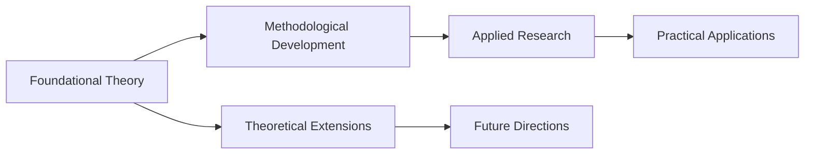

# {{ title }}

> [!Metadata]
> **FirstAuthor**:: {{ first_author }}

> **Author**:: {{ author }}

> **Title**:: {{ title }}
> **Year**:: {{ year or "Unknown" }}
> **Citekey**:: {{ citekey }}
> **itemType**:: {{ item_type }}

> **Journal**:: *{{ journal }}*


> **Volume**:: {{ volume }}


> **Issue**:: {{ issue }}


> **Pages**:: {{ pages }}


> **DOI**:: {{ doi }}



> **Zotero**:: [Open in Zotero]({{ zotero_url }})
> **Zotero Key**:: {{ zotero_key }}


> **Tags**:: #{{ tag|replace('-', '_') }} 


> **Collections**:: {{ zotero_collections|join(', ') }}


> **Date Added**:: {{ date_added }}


> **Date Modified**:: {{ date_modified }}

> **PDF**:: [[{{ source_path }}]]

## Review Overview

### Scope and Objectives
{{ scope or "Review scope, research questions, and objectives addressed" }}

### Search Strategy
{{ search_strategy or "Databases searched, keywords used, and search methodology" }}

### Inclusion/Exclusion Criteria


- {{ criterion }}


- Study types included
- Population characteristics
- Outcome measures
- Time period covered


### Literature Coverage
{{ coverage or "Number of studies reviewed, publication years, and geographic distribution" }}

## Thematic Analysis

### Major Research Themes



#### {{ theme.title or "Theme" }}
**Description:** {{ theme.description or "Theme description" }}
**Key Studies:** {{ theme.studies or "Representative studies in this theme" }}
**Findings:** {{ theme.findings or "Main findings within this theme" }}




#### Foundational Theoretical Work
**Description:** Core theoretical frameworks and models
**Key Studies:** Seminal papers establishing theoretical foundations
**Findings:** Fundamental principles and mathematical formulations

#### Methodological Developments
**Description:** Advances in experimental and computational methods
**Key Studies:** Papers introducing novel methodological approaches
**Findings:** Technical innovations and validation studies

#### Applied Research and Applications
**Description:** Practical implementations and real-world applications
**Key Studies:** Case studies and application-focused research
**Findings:** Performance evaluations and practical outcomes



## Literature Synthesis and Network Analysis

### Theoretical Framework Evolution
{{ theoretical_evolution or "How theoretical understanding has developed over time" }}

### Methodological Progression
{{ methodological_progression or "Evolution of research methods and experimental approaches" }}

### Key Connections and Relationships


- {{ connection }}


- Cross-citations and theoretical building blocks
- Methodological dependencies and improvements
- Conflicting findings and resolution attempts


### Hub References and Influential Work


- **{{ hub.reference }}:** {{ hub.influence or "Description of influence and connections" }}


- Most cited foundational papers
- Methodological breakthrough studies
- Recent high-impact contributions


## Critical Analysis

### Research Gaps and Limitations


- {{ gap }}


- Understudied populations or systems
- Methodological limitations across studies
- Theoretical gaps requiring attention


### Methodological Issues
{{ methodological_issues or "Common methodological problems or limitations identified" }}

### Conflicting Findings
{{ conflicts or "Areas where studies report contradictory results and potential explanations" }}

### Quality Assessment
{{ quality_assessment or "Overall quality of evidence and reliability of conclusions" }}

## Future Research Directions

### Priority Research Areas


- {{ direction }}


- High-priority research questions
- Methodological improvements needed
- Emerging application areas


### Methodological Recommendations
{{ methodological_recommendations or "Suggested improvements to research methods and study designs" }}

### Theoretical Development Needs
{{ theoretical_needs or "Areas where theoretical frameworks require extension or refinement" }}

## Conclusions and Implications

### Key Findings Summary
{{ key_findings or "Primary conclusions from the literature synthesis" }}

### Theoretical Implications
{{ theoretical_implications or "Impact on theoretical understanding and conceptual frameworks" }}

### Practical Implications
{{ practical_implications or "Applications for practitioners, policymakers, or industry" }}

### Research Community Impact
{{ community_impact or "How this review advances the field and guides future research" }}

## Literature Network Visualization


```mermaid
%%{init: {'flowchart': {'htmlLabels': true, 'useMaxWidth': true, 'curve': 'basis'}}}%%
%%{wrap}%%
{{ network_diagram }}
```




**Network Analysis:** {{ network_analysis or "Description of literature connections, clusters, and evolution patterns" }}

---
*Generated on {{ generated_at.strftime('%Y-%m-%d %H:%M:%S') }} using ScholarsQuill*